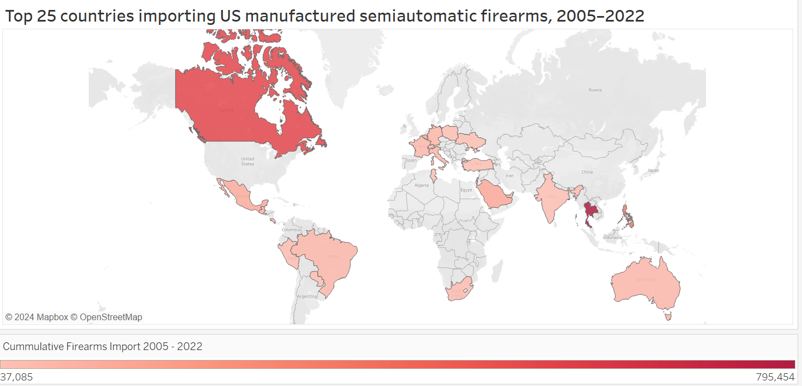
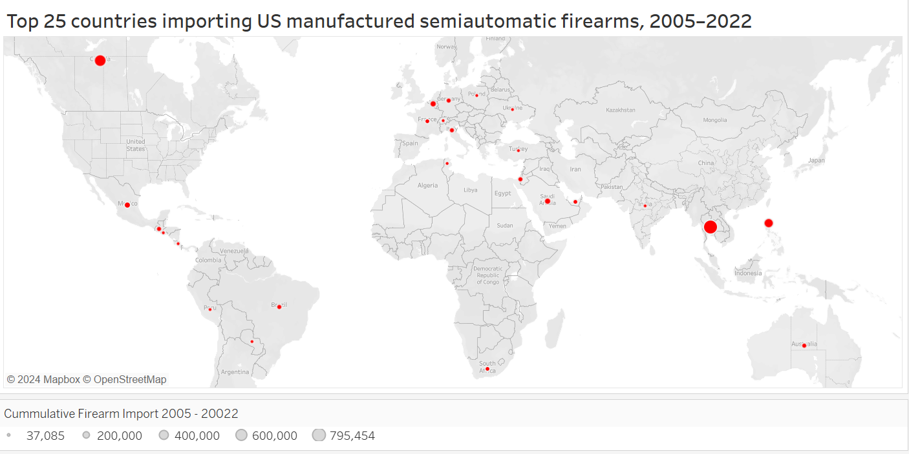

## Makeover Monday - Visualizing export of firearms from the US, 2005 - 2022

### Introduction

[Makeover Monday](https://makeovermonday.co.uk/) is an online community that improves how we visualize data, one chart at a time. The visualization I chose from Makeover Monday's repository is part of a Bloomberg article , ["How the US drives Gun Exports"](https://www.bloomberg.com/graphics/2023-us-made-gun-exports-shootings-violence-sig-sauer/).

  
 
 
  
The original chart, designed as a gunshot, effectively captured attention but lacked clarity in interpretation. It required significant effort to decode its four key elements:

1. Line thickness signifies volume of firearm imports
2. Line length signifies distance from the US
3. Line direction signifies regional associations
4. The countries listed are the top 25 US firearms importers

 
 
### My re-interpretation  
I traded style for clarity. By using a bar chart, I was immediately able to aid comparitive analysis. Further elements that I used are:  
1. Using grey-red contrast to distinguish regions.  
2. Ordering by # of US firearms imported within each region for easy comparison between each region’s top importer.  
  
  

<noscript></noscript><object class='tableauViz'  style='display:none;'><param name='host_url' value='https%3A%2F%2Fpublic.tableau.com%2F' /> <param name='embed_code_version' value='3' /> <param name='site_root' value='' /><param name='name' value='FirearmExports&#47;barchartColor' /><param name='tabs' value='no' /><param name='toolbar' value='yes' /><param name='static_image' value='https:&#47;&#47;public.tableau.com&#47;static&#47;images&#47;Fi&#47;FirearmExports&#47;barchartColor&#47;1.png' /> <param name='animate_transition' value='yes' /><param name='display_static_image' value='yes' /><param name='display_spinner' value='yes' /><param name='display_overlay' value='yes' /><param name='display_count' value='yes' /><param name='language' value='en-US' /></object>

 
     
 
### Appendix: Wireframes that I tried  
The original visualization tried to retain geography by using direction of lines. Hence I tried a chloropeth and a graduated symbol map.  
  
I was however quick to realise that the chloropeth did injustice to the data due to variations in size of our shaded regions. Thailand was the biggest exporter, but what stood out was Canada. Similarly, when using graduated symbol maps, it was very difficult to compare countries and draw conclusions due to the sparse data points. Hence, I shifted to a bar chart.
    
**Chloropeth Wireframe**  

  
**Graduated symbol Wireframe**  

